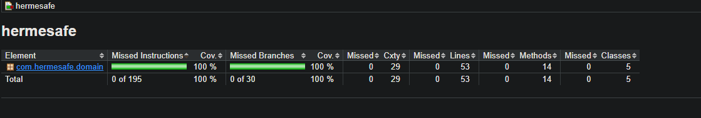

# Tittle: HermeSafe

Hermesafe is a Java Maven project developed with Test Driven Development (TDD).  
All domain classes are written in English and fully tested with JUnit 5, Mockito, and JaCoCo.

---

## Milestone 1: Domain Classes and Coverage

- **RateCalculator**: Calculates shipping rates based on weight and rural surcharge.
- **InventoryManager**: Manages stock and validates operations.
- **PostalCodeValidator**: Validates postal code formats.
- **RouteOptimizer**: Determines coverage and sorts warehouses by distance.

✅ All classes are fully tested.  
✅ JaCoCo report shows **100% coverage**.

Evidence:  

---

## Milestone 2: Test Doubles with Mockito

To simulate external dependencies, I introduced **InventoryRepository** and **OrderService**:

- **InventoryRepository**: Interface representing stock operations.
- **OrderService**: Service that processes orders using the repository.
